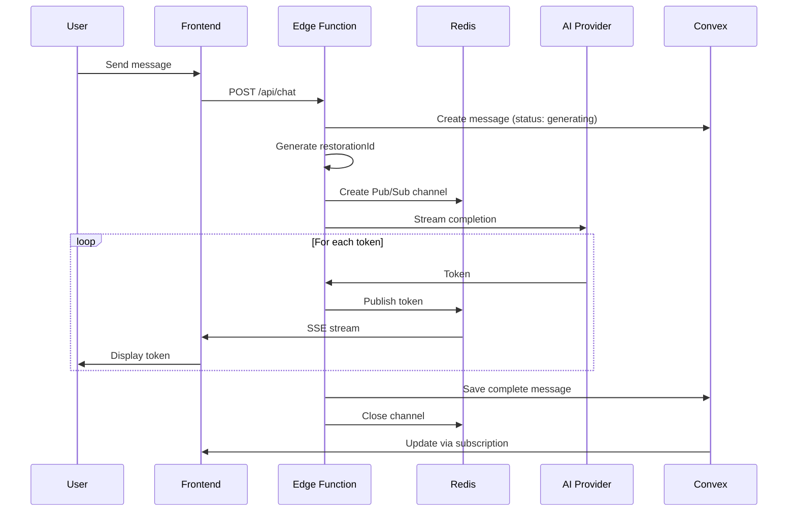
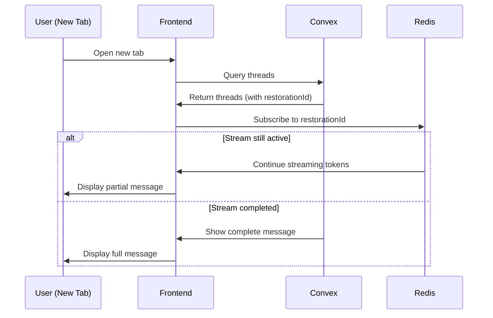

# T3.chat Architecture - Complete Implementation Guide

## Executive Summary

T3.chat uses a **hybrid architecture** that separates streaming concerns from persistence:
- **Convex**: Handles all persistent data (threads, messages, users)
- **Redis Pub/Sub**: Handles real-time token streaming (optimistic updates)
- **Vercel Edge Functions**: Orchestrates AI generation and streaming
- **PostgreSQL**: Auth and subscription management (via Better Auth)

The key insight: **Streaming tokens are treated as optimistic updates, NOT as database state**.

## Core Architecture Principles

### 1. Separation of Concerns
```
Persistent State (Convex) ≠ Streaming State (Redis)
```
- Convex stores **completed messages** only
- Redis Pub/Sub handles **token-by-token streaming**
- This avoids the "trillion rows problem" Theo mentions

### 2. Optimistic Update Pattern
```
User sees: Streaming tokens (Redis) → Falls back to: Complete message (Convex)
```
- Tokens stream directly to UI via Server-Sent Events (SSE)
- Once complete, full message is saved to Convex
- On reconnect, UI shows Convex data + resumes Redis stream if still active

### 3. Resumable Streams
The "magic" feature where streams continue even after disconnect:
- Edge Function continues running (up to 300s timeout)
- Tokens published to Redis channel identified by `restorationId`
- New connections subscribe to the same Redis channel

## System Components

### Frontend (Next.js App)
- **Framework**: Next.js 14+ with App Router
- **State Management**: 
  - React Query for API calls
  - Convex hooks for real-time data
  - Local state for streaming tokens
- **Streaming**: EventSource API for SSE consumption
- **Auth**: Better Auth session management

### Backend Services

#### 1. Vercel Edge Functions (`/api/chat`)
```typescript
// Handles AI generation orchestration
- Receives chat request
- Creates restoration ID
- Publishes to Redis Pub/Sub
- Streams from AI provider
- Saves completed message to Convex
```

#### 2. Convex Backend
```typescript
// Persistent data layer
- Thread management
- Message storage (completed only)
- User preferences
- Rate limiting
- Real-time subscriptions
```

#### 3. Redis Pub/Sub Layer
```typescript
// Streaming coordination
- Channel per restoration ID
- Publishes tokens as they arrive
- Allows multiple subscribers
- Auto-expires after completion
```

#### 4. PostgreSQL (via Better Auth)
```typescript
// Authentication & billing
- User accounts
- OAuth providers
- Subscription management
- Stripe integration
```

## Data Flow Architecture

### Message Generation Flow



### Reconnection Flow



## Implementation Details

### 1. Edge Function Implementation

```typescript
// /app/api/chat/route.ts
export async function POST(req: Request) {
  const { messages, threadId, model } = await req.json();
  
  // 1. Create restoration ID for resumability
  const restorationId = `restore_${nanoid()}`;
  
  // 2. Create message placeholder in Convex
  const messageId = await ctx.runMutation(api.messages.create, {
    threadId,
    role: 'assistant',
    content: '',
    isStreaming: true,
    restorationId,
    model
  });
  
  // 3. Update thread status
  await ctx.runMutation(api.threads.updateStatus, {
    threadId,
    generationStatus: 'generating'
  });
  
  // 4. Initialize Redis Pub/Sub
  const publisher = redis.duplicate();
  const channel = `stream:${restorationId}`;
  
  // 5. Stream from AI provider
  const stream = await openai.chat.completions.create({
    model,
    messages,
    stream: true
  });
  
  // 6. Create SSE response
  const encoder = new TextEncoder();
  const readable = new ReadableStream({
    async start(controller) {
      // Send initial metadata
      controller.enqueue(
        encoder.encode(`f:${JSON.stringify({ 
          messageId, 
          restorationId 
        })}\n`)
      );
      
      let fullContent = '';
      
      for await (const chunk of stream) {
        const token = chunk.choices[0]?.delta?.content || '';
        
        // Stream to client
        controller.enqueue(encoder.encode(`0:"${token}"\n`));
        
        // Publish to Redis for other subscribers
        await publisher.publish(channel, JSON.stringify({
          type: 'token',
          content: token
        }));
        
        fullContent += token;
      }
      
      // Send completion
      const usage = {
        promptTokens: chunk.usage?.prompt_tokens,
        completionTokens: chunk.usage?.completion_tokens
      };
      
      controller.enqueue(
        encoder.encode(`e:${JSON.stringify({ 
          finishReason: 'stop',
          usage 
        })}\n`)
      );
      
      // Save complete message to Convex
      await ctx.runMutation(api.messages.complete, {
        messageId,
        content: fullContent,
        usage,
        isStreaming: false
      });
      
      // Update thread status
      await ctx.runMutation(api.threads.updateStatus, {
        threadId,
        generationStatus: 'completed'
      });
      
      // Publish completion to Redis
      await publisher.publish(channel, JSON.stringify({
        type: 'complete',
        content: fullContent
      }));
      
      // Cleanup
      await publisher.quit();
      controller.close();
    }
  });
  
  return new Response(readable, {
    headers: {
      'Content-Type': 'text/event-stream',
      'Cache-Control': 'no-cache',
      'Connection': 'keep-alive',
    }
  });
}
```

### 2. Frontend Streaming Consumer

```typescript
// hooks/useStreamingMessage.ts
export function useStreamingMessage(messageId: string, restorationId?: string) {
  const [streamingTokens, setStreamingTokens] = useState<string[]>([]);
  const message = useQuery(api.messages.get, { messageId });
  
  useEffect(() => {
    if (!restorationId || message?.isStreaming === false) return;
    
    // Subscribe to Redis stream via SSE endpoint
    const eventSource = new EventSource(
      `/api/stream/${restorationId}`
    );
    
    eventSource.onmessage = (event) => {
      const data = JSON.parse(event.data);
      
      if (data.type === 'token') {
        setStreamingTokens(prev => [...prev, data.content]);
      } else if (data.type === 'complete') {
        eventSource.close();
      }
    };
    
    return () => eventSource.close();
  }, [restorationId, message?.isStreaming]);
  
  // Return streaming tokens if available, otherwise completed message
  return {
    content: streamingTokens.length > 0 
      ? streamingTokens.join('') 
      : message?.content || '',
    isStreaming: message?.isStreaming || false
  };
}
```

### 3. Redis Pub/Sub Bridge

```typescript
// /app/api/stream/[restorationId]/route.ts
export async function GET(
  req: Request,
  { params }: { params: { restorationId: string } }
) {
  const subscriber = redis.duplicate();
  const channel = `stream:${params.restorationId}`;
  
  const stream = new ReadableStream({
    async start(controller) {
      await subscriber.subscribe(channel);
      
      subscriber.on('message', (_, message) => {
        controller.enqueue(
          new TextEncoder().encode(`data: ${message}\n\n`)
        );
        
        const parsed = JSON.parse(message);
        if (parsed.type === 'complete') {
          subscriber.unsubscribe();
          subscriber.quit();
          controller.close();
        }
      });
    }
  });
  
  return new Response(stream, {
    headers: {
      'Content-Type': 'text/event-stream',
      'Cache-Control': 'no-cache',
      'Connection': 'keep-alive',
    }
  });
}
```

## Database Schema Strategy

### What Goes in Convex
- **Persistent State**: Messages, threads, user preferences
- **Completed Data**: Final message content, usage stats
- **Relationships**: User-thread-message associations
- **Configuration**: Rate limits, model settings

### What Goes in Redis
- **Transient Streams**: Token-by-token updates
- **Restoration Channels**: Pub/Sub for resumability
- **TTL**: Auto-expire after ~5 minutes

### What Stays in PostgreSQL
- **Auth Data**: User accounts (Better Auth)
- **Billing**: Stripe subscriptions
- **Audit Logs**: Payment history

## Rate Limiting Architecture

Rate limiting happens at three levels:

1. **Frontend Check**: Quick validation before request
2. **Edge Function**: Verify before AI call
3. **Convex Mutation**: Decrement counters atomically

```typescript
// Convex mutation
export const consumeRateLimit = mutation({
  args: { userId: v.string() },
  handler: async (ctx, { userId }) => {
    const limits = await ctx.db
      .query('rateLimits')
      .withIndex('by_user', q => q.eq('userId', userId))
      .first();
    
    if (!limits) throw new Error('No rate limits found');
    
    // Check availability
    const canConsume = 
      limits.standard.remaining > 0 ||
      limits.premium.remaining > 0;
    
    if (!canConsume) {
      throw new Error('Rate limit exceeded');
    }
    
    // Consume from appropriate tier
    if (limits.standard.remaining > 0) {
      await ctx.db.patch(limits._id, {
        'standard.remaining': limits.standard.remaining - 1,
        'standard.used': limits.standard.used + 1
      });
    } else {
      await ctx.db.patch(limits._id, {
        'premium.remaining': limits.premium.remaining - 1,
        'premium.used': limits.premium.used + 1
      });
    }
    
    return true;
  }
});
```

## Model Management

Models are configured in Convex with tier restrictions:

```typescript
// Convex function
export const getAvailableModels = query({
  args: { userId: v.string() },
  handler: async (ctx, { userId }) => {
    const user = await ctx.db
      .query('users')
      .withIndex('by_auth_user_id', q => q.eq('authUserId', userId))
      .first();
    
    const subscription = await ctx.db
      .query('subscriptions')
      .withIndex('by_user', q => q.eq('userId', userId))
      .first();
    
    const tier = subscription?.tier || 'Free';
    
    // Get models for user's tier
    const models = await ctx.db
      .query('availableModels')
      .filter(q => 
        q.or(
          q.eq(q.field('requiredTier'), 'Free'),
          q.eq(q.field('requiredTier'), tier)
        )
      )
      .collect();
    
    return models;
  }
});
```

## Performance Optimizations

### 1. Token Batching
Instead of sending each token individually, batch them:
```typescript
const tokenBuffer: string[] = [];
const flushInterval = 50; // ms

const flushTokens = () => {
  if (tokenBuffer.length > 0) {
    publisher.publish(channel, JSON.stringify({
      type: 'tokens',
      content: tokenBuffer.join('')
    }));
    tokenBuffer.length = 0;
  }
};

setInterval(flushTokens, flushInterval);
```

### 2. Connection Pooling
Reuse Redis connections:
```typescript
// redis.ts
const pool = new Map<string, Redis>();

export function getRedisClient(purpose: string) {
  if (!pool.has(purpose)) {
    pool.set(purpose, new Redis({
      host: process.env.REDIS_HOST,
      port: process.env.REDIS_PORT,
      maxRetriesPerRequest: 3
    }));
  }
  return pool.get(purpose)!;
}
```

### 3. Convex Query Optimization
Use indexes effectively:
```typescript
// Always query with indexes
const thread = await ctx.db
  .query('threads')
  .withIndex('by_thread_id', q => q.eq('threadId', threadId))
  .first();

// Avoid full table scans
// BAD: .filter(q => q.eq(q.field('threadId'), threadId))
// GOOD: .withIndex('by_thread_id', ...)
```

## Error Handling

### Stream Interruption
```typescript
try {
  // Stream tokens
} catch (error) {
  // Mark as failed in Convex
  await ctx.runMutation(api.messages.markFailed, {
    messageId,
    error: error.message
  });
  
  // Notify via Redis
  await publisher.publish(channel, JSON.stringify({
    type: 'error',
    message: 'Generation failed'
  }));
}
```

### Rate Limit Exceeded
```typescript
// Return 429 with reset time
return new Response(
  JSON.stringify({ 
    error: 'Rate limit exceeded',
    resetsAt: limits.resetsAt 
  }),
  { 
    status: 429,
    headers: {
      'X-RateLimit-Remaining': '0',
      'X-RateLimit-Reset': limits.resetsAt
    }
  }
);
```

## Deployment Configuration

### Environment Variables
```env
# Convex
CONVEX_DEPLOYMENT=production
NEXT_PUBLIC_CONVEX_URL=https://your-deployment.convex.cloud

# Redis (for streaming)
REDIS_HOST=your-redis-host
REDIS_PORT=6379
REDIS_PASSWORD=your-password

# PostgreSQL (for Better Auth)
DATABASE_URL=postgresql://...

# AI Providers
OPENAI_API_KEY=sk-...
ANTHROPIC_API_KEY=sk-ant-...

# Vercel
EDGE_CONFIG=your-edge-config
```

### Vercel Configuration
```json
{
  "functions": {
    "app/api/chat/route.ts": {
      "maxDuration": 300,
      "runtime": "edge"
    }
  }
}
```

## Key Architectural Decisions

### Why Not Store Tokens in Convex?
- **Scale**: "A trillion tokens a month" - storing each token as a row is insane
- **Performance**: Sync engines send full state on each update ("1", then "1,2", then "1,2,3")
- **Cost**: Database storage for transient data is wasteful

### Why Redis for Streaming?
- **Pub/Sub**: Perfect for multi-subscriber scenarios
- **TTL**: Auto-cleanup of completed streams
- **Performance**: In-memory, optimized for this use case
- **Simplicity**: No complex state management

### Why Keep Auth in PostgreSQL?
- **Better Auth**: Already handles this well
- **Stripe Webhooks**: Easier with traditional database
- **Separation**: Auth/billing separate from app logic

## Common Pitfalls to Avoid

1. **Don't store streaming tokens in database** - They're optimistic updates
2. **Don't use WebSockets for AI streaming** - SSE is simpler and sufficient
3. **Don't couple streaming to database state** - Keep them separate
4. **Don't skip the restoration ID** - It's key to resumability
5. **Don't trust sync engines for streaming** - They're not built for it

## Testing Strategy

### Unit Tests
- Convex functions (mutations/queries)
- Rate limiting logic
- Token batching

### Integration Tests
- Full streaming flow
- Reconnection scenarios
- Rate limit enforcement

### Load Tests
- Concurrent streams
- Redis Pub/Sub capacity
- Edge Function timeouts

## Monitoring & Observability

### Key Metrics
- Stream completion rate
- Average tokens per second
- Redis memory usage
- Convex function duration
- Rate limit hit rate

### Alerts
- Stream failures > 1%
- Redis connection errors
- Convex quota warnings
- Edge Function timeouts

## Future Considerations

### Scaling Redis
- Redis Cluster for high load
- Or migrate to managed service (Upstash, Redis Cloud)

### Optimizing Costs
- Batch token updates more aggressively
- Use cheaper models for certain operations
- Implement smart caching

### Enhanced Features
- Voice streaming
- Multi-modal support
- Collaborative editing
- Real-time translations

---

This architecture has been battle-tested at scale by t3.chat and represents the current best practices for building AI chat applications with streaming capabilities

